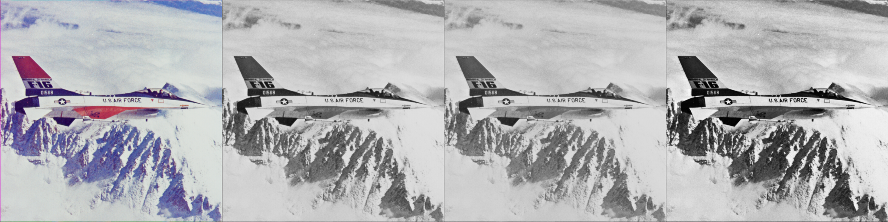
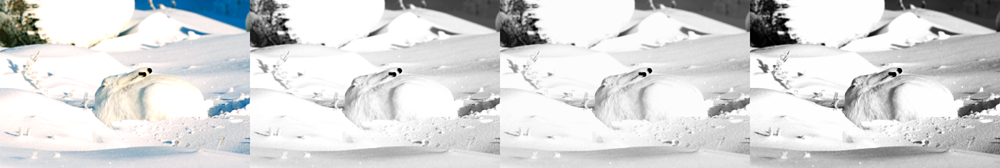

# AutoContrast

This is a tool based on NumPy to automatically increase contrast of an image.

The idea behind this technique is that RGB has a lot of information to create
the perfect greyscale. Standard conversion of RGB to grayscale is **not** linear.
It includes a gamma factor. But linear combination of R, G, and B channels can
give pretty nice results. Based on the weights for combining R,G,B channels,
we can change the tone of the grayscale image. Here, we use different weights
for each channel and different weights for each pixel.

Contrast can be in someway defined as the variance in the image. High contrast
is not necessarily a good characteristic of a photo but is sometimes appreciated
as it would help to show more details in the photo. Here, we try to maximize
the variance of the image by adjusting the weights of R,G,B channels. In some
cases, where there is a natural setting for variance to blow up (like a white
spot in a mostly-dark photo), we need to maximize the mean of the image as well,
so as to keep the average intensity of the image high.

This does not work perfectly in every case but performs decently well in some
cases, as it would be demonstrated. Of course, in some cases, you might rather
keep the RGB image.

Below are some good examples. From left to right, the ordering is
**Original RGB/Greyscale**,
**Standard linear conversion using OpenCV's weight**,
**Initial conversion using equal weights**,
**Final results**

Now, some bad examples.

The idea of good and bad is subjective. But the cases where more details can
be seen are definitely good.

## Used packages and their versions

Important packages used in this code and their versions are:

* Python - 3.7.6
* NumPy - 1.17.5
* Imageio - 2.6.1
* Matplotlib - 3.1.1

## Courtesy

Images were obtained from [here](https://homepages.cae.wisc.edu/~ece533/images/).
I believe these are some standard images in image processing. Weights used by
OpenCV was obtained from [here](https://docs.opencv.org/2.4/modules/imgproc/doc/miscellaneous_transformations.html#void%20cvtColor(InputArray%20src,%20OutputArray%20dst,%20int%20code,%20int%20dstCn)).
